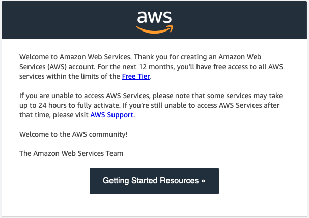
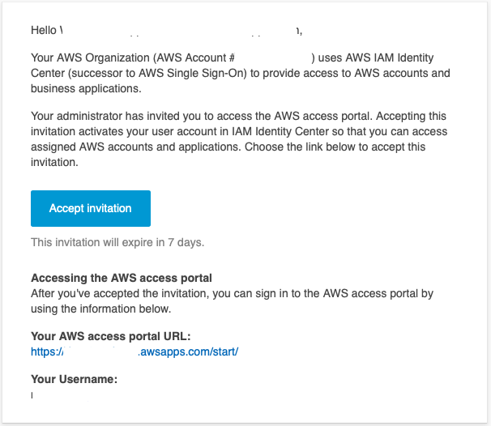
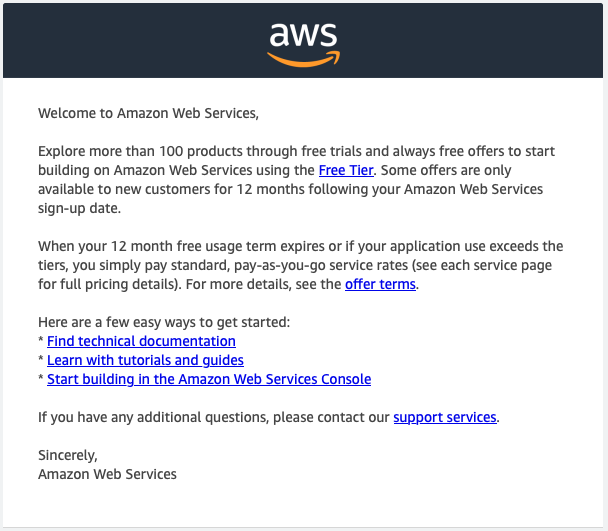
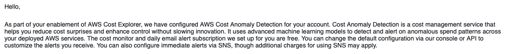
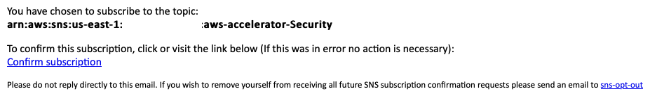

Now that our pipeline has run all the way through with some additional configuration, let's see what we got.  We created
4 new accounts.

| Account Name   | Purpose                                                                                  |
|----------------|------------------------------------------------------------------------------------------|
| Network        | This is the account we will use as our central location for network services.            |
| SharedServices | An account where we can place any services that are used across our entire landing zone. |
| DevTools       | An account that will house our code repositories and CICD pipelines.                     |
| Sandbox        | An account that we can start using to familiarize ourselves with working in AWS.         |

And we have some 'basic' accounts for management:

| Account Name       | Purpose                                                                                                                                                           |
|--------------------|-------------------------------------------------------------------------------------------------------------------------------------------------------------------|
| Management Account | Account where we will deploy and manage our Landing Zone environment.                                                                                             |
| Audit Account      | Also referred to as our 'Security' account.  This account is setup to administer all of our security services  like AWS Config, GuardDuty, and Security Hub. |
| LogArchive         | This account holds the logging S3 buckets that receive logs from all our accounts.                                                                                |

While the pipeline was running, a few emails came in.  

For each account we received:

1. Email saying "Welcome to Amazon Web Services"

    

2. Email invitation to join IAM Identity Center.  This email is sent to the root email address used to create the account. 
We DO NOT have to accept this invite.

3. Email indicating that the AWS Account is ready

4. Email regarding AWS Cost Anomaly detection associated with the management account.

    

In the `global-config.yaml` file we configured an SNS topic called security. This topic was created in our LogArchive account.
We received an email to confirm the subscription.

We also received several messages from the `Config Rules Compliance Change` SNS topic for each new resource created/modified.
This comes from our SNS subcription to `aws-controltower-AggregateSecurityNotifications` topic.

This topic exists in each AWS Region we have configured for our Landing Zone.  It forwards messages it receives from another
SNS topic, `aws-controltower-SecurityNotifications` which receives compliance, noncompliance, and change notifications from
AWS Config in the configured region. For more information on notifications from Control Tower see [here](https://docs.aws.amazon.com/controltower/latest/userguide/receive-notifications.html).

Below is the list of alerts received from the pipeline run.

### Config Rule Compliance Change Alerts

| Resource Type              | Number of alerts |
|----------------------------|------------------|
| AWS::::Account             | 106              |
| AWS::Athena::WorkGroup     | 6                |
| AWS::CloudFormation::Stack | 129              |
| AWS::CloudTrail::Trail     | 18               |
| AWS::ECR::Repository       | 18               |
| AWS::IAM::Group            | 6                |
| AWS::IAM::Policy           | 108              |
| AWS::IAM::Role             | 441              |
| AWS::Kinesis::Stream       | 1                |
| AWS::KMS::Key              | 74               |
| AWS::Lambda::Function      | 238              |
| AWS::S3::Bucket            | 109              |
| AWS::SNS::Topic            | 28               |
| TOTAL                      | 1282             |

This is a lot of information, we'll have to do something about this or our inbox(es) will get full fast and if we receive too
many, there is a chance that something falls through the cracks if someone starts to consider this "noise" and "can be ignored."
The documentation regarding notifications from Control Tower mentions that "SNS topics in AWS Control Tower are extremely noisy, by design."
The page does mention a way to filter some of the noise, so we are going to put some of that in place later.  As we are
configuring out our environment we will be creating (and possibly destroying) a lot of resources, and we don't need to be notified
when Config detects a new resource.  We do however, want to be able to see things that are `NON_COMPLIANT` so that we can fix those later.
There are other SNS topics created with different levels of notifications.  To see those, see [this link](https://docs.aws.amazon.com/controltower/latest/userguide/sns-guidance.html).
For now, we will keep going.  The next page details how we can start to get into each of our accounts to continue
with reviewing what has been installed for us.

