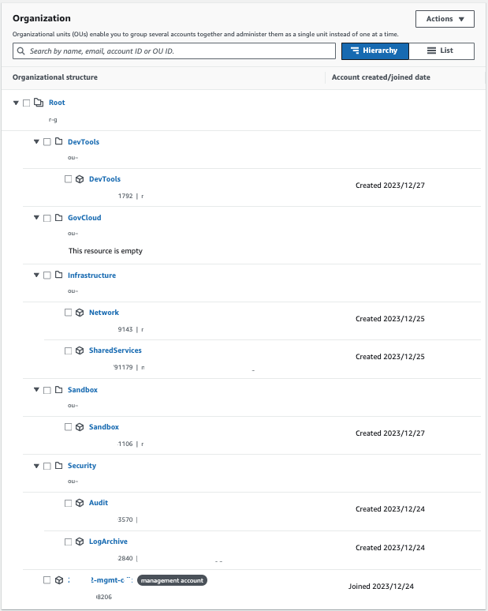
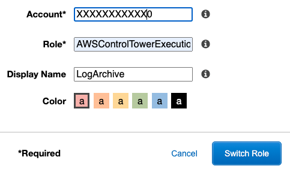
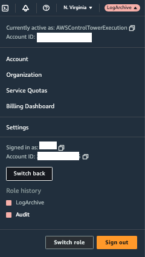
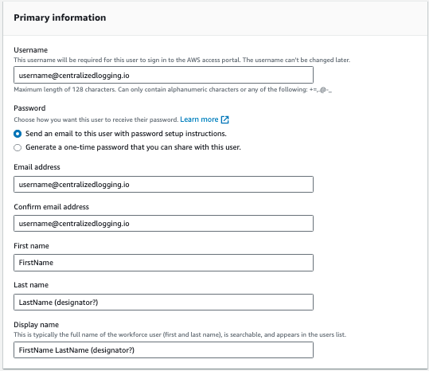
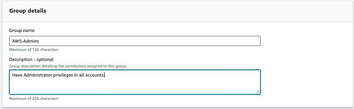
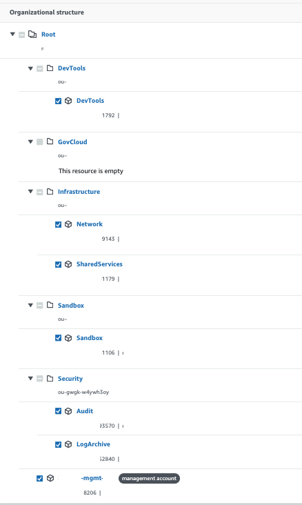
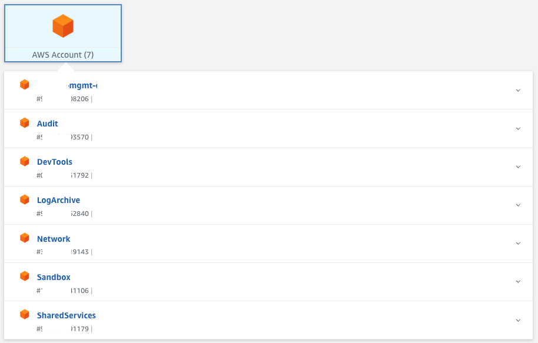
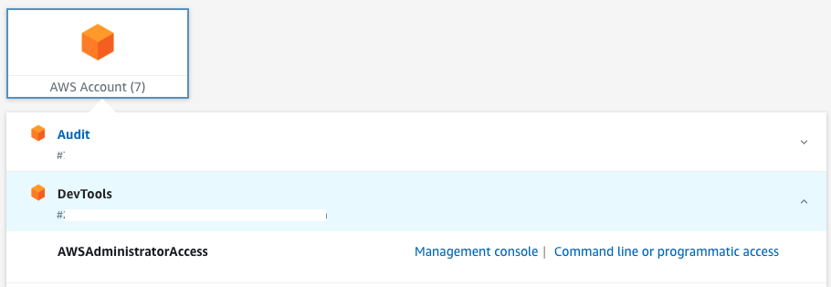

With everything installed and new accounts created, how do you get around?  We want to do some verification of what was installled
but how do we log in to the log and audit account?  How do we log in to the accounts that we created?  There are a few ways
we can do this.

### Assume Role into other accounts
With Control Tower installed, you can use the AWSControlTowerExecution role to go into any of the accounts managed by
Control Tower.  You will need to have your account numbers handy so if you have a text editor open, it might be a good
idea to copy/paste those account numbers and account names in it. An easy way to do this would be to open the `Control Tower`
console, and select `Organizations`.  This will give you a nice list.    
    
** Note that in all images below, account numbers and email addresses have been hidden.

    

The process below gets you into the Log account, but the process can be followed to enter into any of your accounts.

1. Log in to your Landing Zone Management Account
2. In the upper right hand corner select the down arrow next to your login and select `Switch Role`
3. Enter the account id of the account you want to get into the `Account*` box
4. For role, enter `AWSControlTowerExecution`
5. Enter a `Display Name`. This is going to be put in the drop-down so that you do not have to enter this all the time.
6. Click `Switch Role` to enter into the account    

     
7.  You should see the Display Name you entered now appear in the upper right hand corner.

If you select the down arrow you should see your Role History as well. You can cache up to 5 roles.  After that they start 
rotating.
    
    

8. To go back to the management account, click on the `Switch back` button in the drop-down

### Create SSO User
This is the preferred method because it's just easier to bounce around accounts as needed.

1. Log in to your Landing Zone Management Account
2. Open `IAM Identity Center (successor to  AWS Single Sign-On)` console
3. Select `Users` from the menu
4. Click `Add user`
5. Enter a username, email address, first and last name.  I usually put use email addresses as usernames.    
    
6. Click `Next`
7. On the `Add user to groups - optional` screen, select `Create group`
8. For `Group name` enter `AWS-Admins`.  Enter a description if you want.    
    
9. Click `Create group`
10. This opened a new tab to create the group.  Go back to the `Add user` tab
11. Click on the refresh button next to `Create group`
12. Select the `AWS-Admins` group that was just created
13. Click `Next`
14. Click `Add user`
15. Click on `AWS accounts` from the menu
16. Expand all OUs and select all accounts    
     
17. Click `Assign users or groups`
18. Select the `AWS-Admins` group from the list
19. Click `Next`
20. Select `AWSAdministratorAccess` 
21. Click `Next`
22. Click `Submit`

A textbox will appear showing the progress of provisioning into the accounts.  Once it is completed, you will see a green bar
across the top showing `We provisioned your AWS accounts successfully and applied the updated permission set to the accounts.`

Check the inbox of the user you just added.  Emails should have been sent that will allow for a password reset with the subject
`Invitation to join IAM Identity Center (successor to AWS Single Sign-On)`.  Select `Accept invitation` inside the email 
to set up a new password.

To login in the future:
23. Click on `Dashboard` from the menu
24. Look for the `Settings summary` box
25. Find your `AWS access portal URL` 

The `AWS access portal URL` is what will be used to log in using the account created in the previous process.  Once logged in,
a screen similar to the following will appear showing all the accounts that the user has access to.

    
    
Selecting the down arrow next to the account will display the assigned roles. In this case, `AWSAdministratorAccess`
would be the only role to appear.  CLicking on `Management Console` will log the user into the account with Administrator
access.  `Command line or programmatic access` will provide temporary access keys.  Although if you want to use the AWS CLI
to [use sso](https://docs.aws.amazon.com/cli/latest/userguide/cli-configure-sso.html).

    

