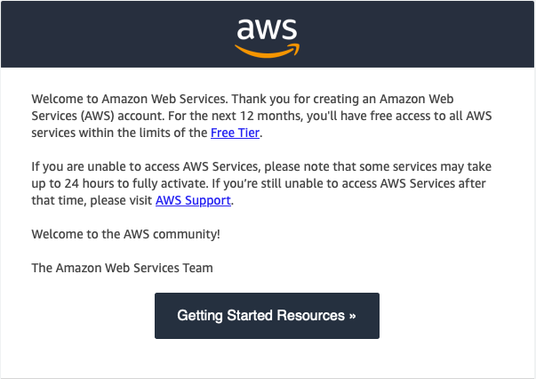

Let's go ahead and get our GovCloud account resources up and running so we can start working in GovCloud.  We have done some
setup already.  For example, we have setup a GovCloud OU that all of our mapped commercial accounts will be in. This will
help us to make sure that in the associated Commercial accounts, we do not deploy any workloads.  These accounts exist
solely for billing purposes.
    
Let's now vend some accounts in GovCloud to get going.

1. Open the accounts-config.yaml file for your commercial configuration
2. Under the `workloadAccounts` section, add the following:

```yaml
  - name: LogArchiveGC # referred to as LogArchive in the GovCloud account-config.yaml
    description: The log archive account for GovCloud.
    email: <govCloud-log-archive-email@example.com> <----- UPDATE EMAIL ADDRESS
    organizationalUnit: GovCloud
    enableGovCloud: true
  - name: AuditGC # referred to as LogArchive in the GovCloud account-config.yaml
    description: The security audit account (also referred to as the audit account) for GovCloud.
    email: <govCloud-audit-email@example.com> <----- UPDATE EMAIL ADDRESS
    organizationalUnit: GovCloud
    enableGovCloud: true
  - name: SharedServicesGC # referred to as SharedServices in the GovCloud account-config.yaml
    description: Shared services account for GovCloud.
    email: <govCloud-sharedservices-email@example.com> <----- UPDATE EMAIL ADDRESS
    organizationalUnit: GovCloud
    enableGovCloud: true
  - name: NetworkGC # referred to as Network in the GovCloud account-config.yaml
    description: Network account for GovCloud.
    email: <govCloud-network-email@example.com> <----- UPDATE EMAIL ADDRESS
    organizationalUnit: GovCloud
    enableGovCloud: true
```

3. Update all the `email:` lines with the appropriate email address you want to use.  These need to be email addresses 
you have not used.  I like to use plus notation and generally do something like `aws-accounts+gc-LogArchivGC@domain`
4. I also want to mimic the account structure I have in my Commercial region, so I'm adding the following as well to create 
the DevTools and Sandbox accounts, so I can get them created at the same time.

```yaml
  - name: DevToolsGC
    description: Centralized DevTools account for GovCloud partition
    email: <govCloud-devtoolsgc-email@example.com> <----- UPDATE EMAIL ADDRESS
    organizationalUnit: GovCloud
    enableGovCloud: true
  - name: SandboxGC
    description: Database account for Workload-A in GovCloud partition
    email: <govCloud-workload-a-dev-databasegc-email@example.com> <----- UPDATE EMAIL ADDRESS
    organizationalUnit: GovCloud
    enableGovCloud: true
```
* Appendng GC is optional. I use it here so that if I am logged in with SSO, I can see from the name of the account, that I 
am in the GovCloud partition.
    
5. Open `global-config.yaml`
6. Set `cloudtrail:` `enabled:` to `true`
7. Set `organizationalTrail:` to `true`

```yaml
  cloudtrail:
    enable: true
    organizationTrail: true
```

8. Close the `global-config.yaml` file
9. Open the `security-config.yaml` file
10. Remove the '[]' after `snsSubscriptions` and paste the following on the next line
```yaml
 - level: High
   email: <security-notifications-high>@example.com  <----- UPDATE EMAIL ADDRESS
 - level: Medium
   email: <security-notifications-medium>@example.com  <----- UPDATE EMAIL ADDRESS
 - level: Low
   email: <security-notifications-low>@example.com  <----- UPDATE EMAIL ADDRESS
```
11. Update the email addresses 
12. Go ahead and test the configuration to make sure all is good
13. If all good, push the updated changes up to the repository
14. Open the `CodePipeline` console in your `Management Account` and select `Release change`

During the pipeline execution, you should expect to receive a few emails as the accounts are being created.

For each account, you will receive a `Welcome to Amazon Web Services` email    
    
    
For each account, you will receive an additional `Welcome to Amazon Web Services` email.  This one is different than
the previous.

    
    
For each account, an invitation for the root email, the email address used in the `accounts-config.yaml`. to join SSO.  You
DO NOT need to accept this invitation.  
    
For each of the security notifications (Low, Medium and High), a subscription notification for the SNS topics.   You will 
need to confirm these subscriptions.

    