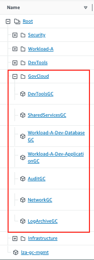
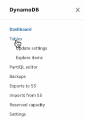
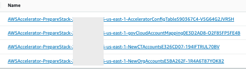
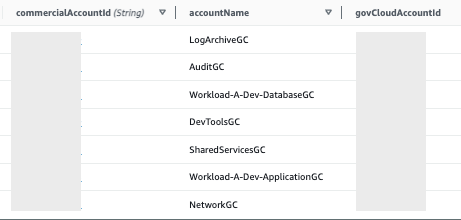

Now that the pipeline is completed, you now have your GovCloud accounts provisioned with their associated commercial accounts.
If you open `Organization` in the `Control Tower` console in the commercial management account, you should see something
similar to this.

    
    
The accounts in the red box are what was created in the previous step.  These are the Commercial accounts associated with
your GovCloud accounts.  They are in the GovCloud OU which has an SCP attached to it to deny use of any services in these accounts.


    
## Get GovCloud Account Mappings

1. In the Commercial management account, open the `DynamoDB` console
2. Select `Tables` from the menu to list your tables    
    
3. Look for the table that contains `govCloudAccountMappings` in the name and click on it    
    
4. Click on the `Explore table Items` button. You should see a table containing the `commercialAccountId`, `accountName`,
and `govCloudAccountId`
    
5. Copy the contents of this table to a text file or some place where you can see them later
6. You can now log out of the commercial management account


## Create Organization in GovCloud
We are now going to repeat the process of deploying LZA, but we will do it in the `GovCloud Management Account`. There
are a few differences, but the process is a little similar.

1. Login to the `GovCloud Management Account`
2. Navigate to the `Organizations` console
3. Click the `Create an organization` button
4. You should see a green banner across the top of the console showing `You successfully created an AWS organization.`
5. From the `AWS Organizations` console menu, select `AWS accounts`
6. Click the checkbox next to the `Root` OU
7. Select the `Actions` drop down and select `Create new`
8. Under `Organizational unit name` enter `Infrastructure`
9. Click `Create organizational unit`
10. Repeat this process creating an OU for `DevTools` and `Workload-A/Development`


## Create KMS Key
Just like our commercial side accounts, we want to `encrypt all the things.`  Control Tower allows for you to set up 
encryption for AWS CloudTrail and AWS Config, and we want to do this.  

1. Open the `KMS Console` in the `Management account`
2. Click the `Create a key` button
3. Leave `Symmetric` and `Encrypt and Decrypt` selected
4. Click `Next`
5. For `Alias` enter `kms-key-for-lza`
6. For `Description` enter `KMS key used by LZA`
7. Click `Next`
8. For `Key administrators` select `Admin`
9. Click `Next`
10. For `Define key usage permissions` select `Admin`
11. Click `Next`
12. Replace the `Key policy`, with the one below.  Replace `ACCOUNT_ID` with the account id of your account.

```json
{
    "Version": "2012-10-17",
    "Statement": [
        {
            "Sid": "Enable IAM User Permissions",
            "Effect": "Allow",
            "Principal": {
                "AWS": "arn:aws-us-gov:iam::ACCOUNT_ID:root"
            },
            "Action": "kms:*",
            "Resource": "*"
        },
        {
            "Sid": "Allow access for Key Administrators",
            "Effect": "Allow",
            "Principal": {
                "AWS": "arn:aws-us-gov:iam::ACCOUNT_ID:root"
            },
            "Action": [
                "kms:CancelKeyDeletion",
                "kms:Create*",
                "kms:Delete*",
                "kms:Describe*",
                "kms:Disable*",
                "kms:Enable*",
                "kms:Get*",
                "kms:List*",
                "kms:Put*",
                "kms:Revoke*",
                "kms:ScheduleKeyDeletion",
                "kms:TagResource",
                "kms:UntagResource",
                "kms:Update*"
            ],
            "Resource": "*"
        },
        {
            "Sid": "Allow use of the key",
            "Effect": "Allow",
            "Principal": {
                "AWS": "arn:aws-us-gov:iam::ACCOUNT_ID:root"
            },
            "Action": [
                "kms:Decrypt",
                "kms:DescribeKey",
                "kms:Encrypt",
                "kms:GenerateDataKey*",
                "kms:ReEncrypt*"
            ],
            "Resource": "*"
        },
        {
            "Sid": "Allow Cloudtrail and Config to encrypt/decrypt logs",
            "Effect": "Allow",
            "Principal": {
                "Service": [
                    "config.amazonaws.com",
                    "cloudtrail.amazonaws.com"
                ]
            },
            "Action": [
                "kms:Decrypt",
                "kms:GenerateDataKey*"
            ],
            "Resource": "*"
        },
        {
            "Sid": "Allow attachment of persistent resources",
            "Effect": "Allow",
            "Principal": {
                "AWS": "arn:aws-us-gov:iam::ACCOUNT_ID:root"
            },
            "Action": [
                "kms:CreateGrant",
                "kms:ListGrants",
                "kms:RevokeGrant"
            ],
            "Resource": "*",
            "Condition": {
                "Bool": {
                    "kms:GrantIsForAWSResource": "true"
                }
            }
        }
    ]
}
```
13. Click `Finish`

## Set up Secret Key for Github
This only needs to be completed if you will be pulling the LZA code from GitHub.
1. Open the Secrets Manager console
2. Click `Store a new secret`
3. Select `Other type of secret`
4. Under `Key/value pairs`, select `Plaintext`
5. Remove all text from the textbox and paste your GitHub Token in the box
6. For `Encryption key` leave `aws/secretsmanager` selected
7. Click Next
8. For `Secret name` enter `accelerator/github-token`
9. For `Description` you can put something like `Used by LZA to retrieve LZA code from GitHub public repo.`
10. Click `Next`
11. Scroll to the bottom of the page and select `Store`


## Run the LZA installer
1. Open the CloudFormation console
2. Select the `Create stack` dropdown and select `Create new stack`
3. Enter the URL to the LZA installer template `https://s3.amazonaws.com/solutions-reference/landing-zone-accelerator-on-aws/latest/AWSAccelerator-InstallerStack.template`
4. For Stack Name enter `AWSAccelerator-InstallerStack`
5. If you want to send notifications to a specific email for approvals, enter it in the `Manual Approval Stage notification email list`
6. Enter the email address of the management account for GovCloud
7. Enter the email address of the logging account for GovCloud
8. Enter the email address of the audit account for GovCloud
9. Change the `Control Tower Environment` to `No`
10. Click `Next`
11. Click `Next`
12. On the Review page, scroll to the bottom and click the checkbox next to `I acknowledge...`
13. Click `Submit`
14. Wait for the `AWSAccelerator-InstallerStack` stack to show `CREATE_COMPLETE`
15. Open the `CodePipeline` console and select the `AWSAccelerator-Installer` pipeline
16. Wait for the pipeline to complete. It is complete when both `Source` and `Install` stages are green
17. Select  `Pipelines` from the breadcrumbs menu, select the `AWSAccelerator-Pipeline`
18. Wait until the `Prepare` stage fails.  This is expected.

## Edit LZA Config Files
1. Open the `CodeCommit` console
2. Click on the `aws-accelerator-config` repository
3. Select the `Clone URL` drop down and select `Clone HTTPS (GRC)`
4. Clone the repository to your local machine
5. Open the `accounts-config.yaml` file
6. Copy the following and paste it OVER workloadAccounts[]
```yaml
workloadAccounts:
  - name: SharedServices
    description: Shared services account for GovCloud.
    email: <govCloud-sharedservices-email@example.com> <----- UPDATE EMAIL ADDRESS
    organizationalUnit: Infrastructure
  - name: Network
    description: Network account for GovCloud.
    email: <govCloud-network-email@example.com> <----- UPDATE EMAIL ADDRESS
    organizationalUnit: Infrastructure
  - name: DevTools
    description: Centralized DevTools account for commercial partition
    email: govCloud-devtools-email@example.com <----- UPDATE EMAIL ADDRESS
    organizationalUnit: DevTools
  - name: Workload-A-Dev-Database
    description: Database account for Workload-A in commercial partition
    email: govCloud-workload-a-dev-database-email@example.com <----- UPDATE EMAIL ADDRESS
    organizationalUnit: Workload-A/Development
  - name: Workload-A-Dev-Application
    description: Application account for Workload-A in commercial partition
    email: govCloud-workload-a-dev-application-email@example.com <----- UPDATE EMAIL ADDRESS
    organizationalUnit: Workload-A/Development 
accountIds:
  - email: <govCloud-management-email@example.com> <----- UPDATE EMAIL ADDRESS
    accountId: 'ACCOUNT_ID'  <----- UPDATE FROM DYNAMODB MAPPING TABLE IN COMMERCIAL MGMT ACCOUNT
  - email: <govCloud-log-archive-email@example.com> <----- UPDATE EMAIL ADDRESS
    accountId: 'ACCOUNT_ID'  <----- UPDATE FROM DYNAMODB MAPPING TABLE IN COMMERCIAL MGMT ACCOUNT
  - email: <govCloud-audit-email@example.com> <----- UPDATE EMAIL ADDRESS
    accountId: 'ACCOUNT_ID'  <----- UPDATE FROM DYNAMODB MAPPING TABLE IN COMMERCIAL MGMT ACCOUNT
  - email: <govCloud-sharedservices-email@example.com> <----- UPDATE EMAIL ADDRESS
    accountId: 'ACCOUNT_ID'  <----- UPDATE FROM DYNAMODB MAPPING TABLE IN COMMERCIAL MGMT ACCOUNT
  - email: <govCloud-network-email@example.com> <----- UPDATE EMAIL ADDRESS
    accountId: 'ACCOUNT_ID'  <----- UPDATE FROM DYNAMODB MAPPING TABLE IN COMMERCIAL MGMT ACCOUNT
  - email: <govCloud-devtools-email@example.com> <----- UPDATE EMAIL ADDRESS
    accountId: 'ACCOUNT_ID'  <----- UPDATE FROM DYNAMODB MAPPING TABLE IN COMMERCIAL MGMT ACCOUNT
  - email: <govCloud-workload-a-dev-application-email@example.com> <----- UPDATE EMAIL ADDRESS
    accountId: 'ACCOUNT_ID'  <----- UPDATE FROM DYNAMODB MAPPING TABLE IN COMMERCIAL MGMT ACCOUNT
  - email: <govCloud-workload-a-dev-database-email@example.com> <----- UPDATE EMAIL ADDRESS
    accountId: 'ACCOUNT_ID'  <----- UPDATE FROM DYNAMODB MAPPING TABLE IN COMMERCIAL MGMT ACCOUNT
```
7. Check-in the file
8. Open the `global-config.yaml` file
9. Replace the entire contents of the file with
```yaml
homeRegion: &HOME_REGION us-gov-west-1
enabledRegions:
  - *HOME_REGION
managementAccountAccessRole: AWSControlTowerExecution
cloudwatchLogRetentionInDays: 3653
centralizeCdkBuckets:
  enable: true
terminationProtection: true
snsTopics:
  deploymentTargets:
    organizationalUnits:
      - Root
  topics:
    - name: Security
      emailAddresses:
        - security-alerts@example.com
controlTower:
  enable: false
logging:
  account: LogArchive
  cloudtrail:
    enable: true
    organizationTrail: true
    organizationTrailSettings:
      multiRegionTrail: true
      globalServiceEvents: true
      managementEvents: true
      s3DataEvents: true
      lambdaDataEvents: true
      sendToCloudWatchLogs: true
      apiErrorRateInsight: false
      apiCallRateInsight: false
    accountTrails:
      - name: AccountTrail
        regions:
          - *HOME_REGION
        deploymentTargets:
          accounts: []
          organizationalUnits:
            - Root
        settings:
          multiRegionTrail: true
          globalServiceEvents: true
          managementEvents: true
          s3DataEvents: true
          lambdaDataEvents: true
          sendToCloudWatchLogs: true
          apiErrorRateInsight: false
          apiCallRateInsight: false
  sessionManager:
    sendToCloudWatchLogs: false
    sendToS3: true
    attachPolicyToIamRoles:
      - EC2-Default-SSM-AD-Role
  cloudwatchLogs:
    dynamicPartitioning: dynamic-partitioning/log-filters.json
  accessLogBucket:
    lifecycleRules:
      - enabled: true
        abortIncompleteMultipartUpload: 7
        expiration: 1000
        noncurrentVersionExpiration: 1000
        transitions:
          - storageClass: GLACIER_IR
            transitionAfter: 365
        noncurrentVersionTransitions:
          - storageClass: GLACIER_IR
            transitionAfter: 365
  centralLogBucket:
    lifecycleRules:
      - enabled: true
        abortIncompleteMultipartUpload: 7
        expiration: 1000
        noncurrentVersionExpiration: 1000
        transitions:
          - storageClass: GLACIER_IR
            transitionAfter: 365
        noncurrentVersionTransitions:
          - storageClass: GLACIER_IR
            transitionAfter: 365
  elbLogBucket:
    lifecycleRules:
      - enabled: true
        abortIncompleteMultipartUpload: 7
        expiration: 1000
        noncurrentVersionExpiration: 1000
        transitions:
          - storageClass: GLACIER_IR
            transitionAfter: 365
        noncurrentVersionTransitions:
          - storageClass: GLACIER_IR
            transitionAfter: 365
 
```
10. Replace the `security-alerts@example.com` with the email address designated to receive the LZA security alerts
11. Check-in the file
12. Open the `iam-config.yaml` file
13. Replace the contents of the file with
```yaml
 providers: []
policySets:
  - deploymentTargets:
      organizationalUnits:
        - Root
    policies:
      - name: Default-Boundary-Policy
        policy: iam-policies/boundary-policy.json
roleSets:
  - deploymentTargets:
      organizationalUnits:
        - Root
    roles:
      - name: EC2-Default-SSM-AD-Role
        instanceProfile: true
        assumedBy:
          - type: service
            principal: ec2.amazonaws.com
        policies:
          awsManaged:
            - AmazonSSMManagedInstanceCore
            - AmazonSSMDirectoryServiceAccess
            - CloudWatchAgentServerPolicy
        boundaryPolicy: Default-Boundary-Policy
groupSets:
  - deploymentTargets:
      organizationalUnits:
        - Root
    groups:
      - name: Administrators
        policies:
          awsManaged:
            - AdministratorAccess
userSets:
  - deploymentTargets:
      accounts:
        - Management
    users:
      - username: breakGlassUser01
        group: Administrators
        boundaryPolicy: Default-Boundary-Policy
      - username: breakGlassUser02
        group: Administrators
        boundaryPolicy: Default-Boundary-Policy

```
14. There is nothing to replace in this file
15. Check-in the file
16. Open the `network-config.yaml` file
17. At the top of the file add `homeRegion: &HOME_REGION us-gov-west-1` above `defaultVPC`
18. Under `defaultVpc` change `delete` from `false` to `true`
19. Check-in the file
20. Open the `organization-config.yaml` file
21. Replace everything from `serviceControlPolicies: []` with the following:
```yaml
 quarantineNewAccounts:
  enable: true
  scpPolicyName: Quarantine
serviceControlPolicies:
  - name: AcceleratorGuardrails1
    description: >
      Accelerator GuardRails 1
    policy: service-control-policies/guardrails-1.json
    type: customerManaged
    deploymentTargets:
      organizationalUnits:
        - Infrastructure
  - name: AcceleratorGuardrails2
    description: >
      Accelerator GuardRails 2
    policy: service-control-policies/guardrails-2.json
    type: customerManaged
    deploymentTargets:
      organizationalUnits:
        - Infrastructure
  - name: Quarantine
    description: >
      This SCP is used to prevent changes to new accounts until the Accelerator
      has been executed successfully.
      This policy will be applied upon account creation if enabled.
    policy: service-control-policies/quarantine.json
    type: customerManaged
    deploymentTargets:
      organizationalUnits: []
# Although GovCloud does support tagging policies, LZA does not yet support implementing it.
# The tagging policy is implemented at  the Organization level in the console.
# The tagging policy is included in the tagging-policies directory for when LZA is updated to support it.
taggingPolicies: []
backupPolicies: []
```
22. Check-in the file
23. Open the `security-config.yaml` file
24. Replace the contents of the file with the following
```yaml
 homeRegion: &HOME_REGION us-gov-west-1
centralSecurityServices:
  delegatedAdminAccount: Audit
  ebsDefaultVolumeEncryption:
    enable: true
    excludeRegions: []
  s3PublicAccessBlock:
    enable: true
    excludeAccounts: []
  scpRevertChangesConfig:
    enable: true
    snsTopicName: Security
  snsSubscriptions:
    - level: High
      email: <security-notifications-gc-high>@example.com  <----- UPDATE EMAIL ADDRESS
    - level: Medium
      email: <security-notifications-gc-medium>@example.com  <----- UPDATE EMAIL ADDRESS
    - level: Low
      email: <security-notifications-gc-low>@example.com  <----- UPDATE EMAIL ADDRESS
  macie:
    enable: false
    excludeRegions: []
    policyFindingsPublishingFrequency: FIFTEEN_MINUTES
    publishSensitiveDataFindings: true
  guardduty:
    enable: true
    excludeRegions: []
    s3Protection:
      enable: true
      excludeRegions: []
    exportConfiguration:
      enable: true
      overrideExisting: true
      destinationType: S3
      exportFrequency: FIFTEEN_MINUTES
  securityHub:
    enable: true
    regionAggregation: true
    excludeRegions: []
    standards:
      # for enum of names, see: https://awslabs.github.io/landing-zone-accelerator-on-aws/classes/_aws_accelerator_config.SecurityHubStandardConfig.html#name
      # add NIST 800-53r5
      - name: NIST Special Publication 800-53 Revision 5
        # https://docs.aws.amazon.com/securityhub/latest/userguide/nist-standard.html
        enable: true
        controlstoDisable: []
        # disable AWS Foundational Security Best Practices v1.0.0
      - name: AWS Foundational Security Best Practices v1.0.0
        # https://docs.aws.amazon.com/securityhub/latest/userguide/fsbp-standard.html
        enable: false
        controlstoDisable: []
        # disable CIS AWS Foundations Benchmark v1.2.0
      - name: CIS AWS Foundations Benchmark v1.2.0
        # https://docs.aws.amazon.com/securityhub/latest/userguide/cis-aws-foundations-benchmark.html
        enable: false
        controlstoDisable: []
        # disable CIS AWS Foundations Benchmark v1.4.0
      - name: CIS AWS Foundations Benchmark v1.4.0
        # https://docs.aws.amazon.com/securityhub/latest/userguide/cis-aws-foundations-benchmark.html
        enable: false
        controlstoDisable: []
        # disable PCI DSS v3.2.1
      - name: PCI DSS v3.2.1
        # https://docs.aws.amazon.com/securityhub/latest/userguide/pci-standard.html
        enable: false
        controlstoDisable: []
  ssmAutomation:
    excludeRegions: []
    documentSets:
      - shareTargets:
          organizationalUnits:
            - Root
        documents:
          # Calls the AWS CLI to enable access logs on a specified ELB
          - name: SSM-ELB-Enable-Logging
            template: ssm-documents/ssm-elb-enable-logging.yaml
          # Enables S3 encryption using KMS
          - name: Put-S3-Encryption
            template: ssm-documents/s3-encryption.yaml
          # Attaches instance profiles to an EC2 instance
          - name: Attach-IAM-Instance-Profile
            template: ssm-documents/attach-iam-instance-profile.yaml
          # Attaches Aws IAM Managed Policy to IAM Role
          - name: Attach-IAM-Role-Policy
            template: ssm-documents/attach-iam-role-policy.yaml
          # Disables SSH to security group
          - name: Disable-Public-SSH
            template: ssm-documents/disable-public-ssh.yaml
          # Enables IMDSV2
          - name: Configure-IMDSV2
            template: ssm-documents/configure_imdsv2.yaml
          # Remove open sec groups that not open ports
          - name: remove-open-security-groups
            template: ssm-documents/remove-open-security-group.yaml

accessAnalyzer:
  enable: true
iamPasswordPolicy:
  allowUsersToChangePassword: true
  hardExpiry: false
  requireUppercaseCharacters: true
  requireLowercaseCharacters: true
  requireSymbols: true
  requireNumbers: true
  minimumPasswordLength: 14
  passwordReusePrevention: 24
  maxPasswordAge: 90
awsConfig:
  enableConfigurationRecorder: true
  enableDeliveryChannel: true
  aggregation:
    enable: true
    delegatedAdminAccount: Audit
  ruleSets:
    - deploymentTargets:
        organizationalUnits:
          - Root
      rules:
        - name: accelerator-attach-ec2-instance-profile
          type: Custom
          description: Custom rule for checking EC2 instance IAM profile attachment
          inputParameters:
          customRule:
            lambda:
              sourceFilePath: custom-config-rules/attach-ec2-instance-profile.zip
              handler: index.handler
              runtime: nodejs14.x
              rolePolicyFile: custom-config-rules/attach-ec2-instance-profile-detection-role.json
            periodic: true
            maximumExecutionFrequency: Six_Hours
            configurationChanges: true
            triggeringResources:
              lookupType: ResourceTypes
              lookupKey: ResourceTypes
              lookupValue:
                - AWS::EC2::Instance
          remediation:
            rolePolicyFile: custom-config-rules/attach-ec2-instance-profile-remediation-role.json
            automatic: true
            targetId: Attach-IAM-Instance-Profile
            retryAttemptSeconds: 60
            maximumAutomaticAttempts: 5
            parameters:
              - name: InstanceId
                value: RESOURCE_ID
                type: String
              - name: IamInstanceProfile
                value: ${ACCEL_LOOKUP::InstanceProfile:EC2-Default-SSM-AD-Role}
                type: StringList
        - name: accelerator-ec2-instance-profile-permission
          type: Custom
          description: Custom role to remediate EC2 instance profile permission
          inputParameters:
            AWSManagedPolicies: AmazonSSMManagedInstanceCore,AmazonSSMDirectoryServiceAccess,CloudWatchAgentServerPolicy
            CustomerManagedPolicies: arn:aws-us-gov:iam::aws:policy/AmazonSSMManagedInstanceCore
            ResourceId: RESOURCE_ID
          customRule:
            lambda:
              sourceFilePath: custom-config-rules/ec2-instance-profile-permissions.zip
              handler: index.handler
              runtime: nodejs14.x
              rolePolicyFile: custom-config-rules/ec2-instance-profile-permissions-detection-role.json
            periodic: true
            maximumExecutionFrequency: Six_Hours
            configurationChanges: true
            triggeringResources:
              lookupType: ResourceTypes
              lookupKey: ResourceTypes
              lookupValue:
                - AWS::IAM::Role
          remediation:
            rolePolicyFile: custom-config-rules/ec2-instance-profile-permissions-remediation-role.json
            automatic: true
            targetId: Attach-IAM-Role-Policy
            targetAccountName: Audit
            retryAttemptSeconds: 60
            maximumAutomaticAttempts: 5
            parameters:
              - name: ResourceId
                value: RESOURCE_ID
                type: String
              - name: AWSManagedPolicies
                value: AmazonSSMManagedInstanceCore,AmazonSSMDirectoryServiceAccess,CloudWatchAgentServerPolicy
                type: StringList
        - name: accelerator-s3-bucket-server-side-encryption-enabled
          identifier: S3_BUCKET_SERVER_SIDE_ENCRYPTION_ENABLED
          complianceResourceTypes:
            - AWS::S3::Bucket
          remediation:
            rolePolicyFile: custom-config-rules/bucket-sse-enabled-remediation-role.json
            automatic: true
            targetId: Put-S3-Encryption
            retryAttemptSeconds: 60
            maximumAutomaticAttempts: 5
            parameters:
              - name: BucketName
                value: RESOURCE_ID
                type: String
              - name: KMSMasterKey
                value: ${ACCEL_LOOKUP::KMS}
                type: StringList
        - name: accelerator-elb-logging-enabled
          identifier: ELB_LOGGING_ENABLED
          complianceResourceTypes:
            - AWS::ElasticLoadBalancing::LoadBalancer
            - AWS::ElasticLoadBalancingV2::LoadBalancer
          inputParameters:
            s3BucketNames: ${ACCEL_LOOKUP::Bucket:elbLogs}
          remediation:
            rolePolicyFile: custom-config-rules/elb-logging-enabled-remediation-role.json
            automatic: true
            targetId: SSM-ELB-Enable-Logging
            retryAttemptSeconds: 60
            maximumAutomaticAttempts: 5
            parameters:
              - name: LoadBalancerArn
                value: RESOURCE_ID
                type: String
              - name: LogDestination
                value: ${ACCEL_LOOKUP::Bucket:elbLogs}
                type: StringList
        - name: accelerator-iam-user-group-membership-check
          complianceResourceTypes:
            - AWS::IAM::User
          identifier: IAM_USER_GROUP_MEMBERSHIP_CHECK
        - name: accelerator-securityhub-enabled
          identifier: SECURITYHUB_ENABLED
        - name: accelerator-cloudtrail-enabled
          identifier: CLOUD_TRAIL_ENABLED
        - name: accelerator-rds-logging-enabled
          complianceResourceTypes:
            - AWS::RDS::DBInstance
          identifier: RDS_LOGGING_ENABLED
        - name: accelerator-cloudwatch-alarm-action-check
          complianceResourceTypes:
            - AWS::CloudWatch::Alarm
          inputParameters:
            alarmActionRequired: "TRUE"
            insufficientDataActionRequired: "TRUE"
            okActionRequired: "FALSE"
          identifier: CLOUDWATCH_ALARM_ACTION_CHECK
        - name: accelerator-redshift-cluster-configuration-check
          inputParameters:
            clusterDbEncrypted: "TRUE"
            loggingEnabled: "TRUE"
          complianceResourceTypes:
            - AWS::Redshift::Cluster
          identifier: REDSHIFT_CLUSTER_CONFIGURATION_CHECK
        - name: accelerator-cloudtrail-s3-dataevents-enabled
          identifier: CLOUDTRAIL_S3_DATAEVENTS_ENABLED
        - name: accelerator-emr-kerberos-enabled
          identifier: EMR_KERBEROS_ENABLED
        - name: accelerator-iam-group-has-users-check
          complianceResourceTypes:
            - AWS::IAM::Group
          identifier: IAM_GROUP_HAS_USERS_CHECK
        - name: accelerator-s3-bucket-policy-grantee-check
          complianceResourceTypes:
            - AWS::S3::Bucket
          identifier: S3_BUCKET_POLICY_GRANTEE_CHECK
        - name: accelerator-lambda-inside-vpc
          complianceResourceTypes:
            - AWS::Lambda::Function
          identifier: LAMBDA_INSIDE_VPC
        - name: accelerator-ec2-instances-in-vpc
          complianceResourceTypes:
            - AWS::EC2::Instance
          identifier: INSTANCES_IN_VPC
        - name: accelerator-vpc-sg-open-only-to-authorized-ports
          inputParameters:
            authorizedTcpPorts: "443"
            authorizedUdpPorts: "1020-1025"
          complianceResourceTypes:
            - AWS::EC2::SecurityGroup
          identifier: VPC_SG_OPEN_ONLY_TO_AUTHORIZED_PORTS
        - name: accelerator-ec2-instance-no-public-ip
          complianceResourceTypes:
            - AWS::EC2::Instance
          identifier: EC2_INSTANCE_NO_PUBLIC_IP
        - name: accelerator-elasticsearch-in-vpc-only
          identifier: ELASTICSEARCH_IN_VPC_ONLY
        - name: accelerator-internet-gateway-authorized-vpc-only
          complianceResourceTypes:
            - AWS::EC2::InternetGateway
          identifier: INTERNET_GATEWAY_AUTHORIZED_VPC_ONLY
        - name: accelerator-iam-no-inline-policy-check
          complianceResourceTypes:
            - AWS::IAM::User
            - AWS::IAM::Role
            - AWS::IAM::Group
          identifier: IAM_NO_INLINE_POLICY_CHECK
        - name: accelerator-elb-acm-certificate-required
          complianceResourceTypes:
            - AWS::ElasticLoadBalancing::LoadBalancer
          identifier: ELB_ACM_CERTIFICATE_REQUIRED
        - name: accelerator-alb-http-drop-invalid-header-enabled
          complianceResourceTypes:
            - AWS::ElasticLoadBalancingV2::LoadBalancer
          identifier: ALB_HTTP_DROP_INVALID_HEADER_ENABLED
        - name: accelerator-elb-tls-https-listeners-only
          complianceResourceTypes:
            - AWS::ElasticLoadBalancing::LoadBalancer
          identifier: ELB_TLS_HTTPS_LISTENERS_ONLY
        - name: accelerator-api-gw-execution-logging-enabled
          complianceResourceTypes:
            - AWS::ApiGateway::Stage
            - AWS::ApiGatewayV2::Stage
          identifier: API_GW_EXECUTION_LOGGING_ENABLED
        - name: accelerator-cloudwatch-log-group-encrypted
          identifier: CLOUDWATCH_LOG_GROUP_ENCRYPTED
        - name: accelerator-s3-bucket-replication-enabled
          complianceResourceTypes:
            - AWS::S3::Bucket
          identifier: S3_BUCKET_REPLICATION_ENABLED
        - name: accelerator-cw-loggroup-retention-period-check
          identifier: CW_LOGGROUP_RETENTION_PERIOD_CHECK
        - name: accelerator-ec2-instance-detailed-monitoring-enabled
          complianceResourceTypes:
            - AWS::EC2::Instance
          identifier: EC2_INSTANCE_DETAILED_MONITORING_ENABLED
        - name: accelerator-ec2-volume-inuse-check
          inputParameters:
            deleteOnTermination: "TRUE"
          complianceResourceTypes:
            - AWS::EC2::Volume
          identifier: EC2_VOLUME_INUSE_CHECK
        - name: accelerator-elb-deletion-protection-enabled
          complianceResourceTypes:
            - AWS::ElasticLoadBalancingV2::LoadBalancer
          identifier: ELB_DELETION_PROTECTION_ENABLED
        - name: accelerator-cloudtrail-security-trail-enabled
          identifier: CLOUDTRAIL_SECURITY_TRAIL_ENABLED
        - name: accelerator-elasticache-redis-cluster-automatic-backup-check
          identifier: ELASTICACHE_REDIS_CLUSTER_AUTOMATIC_BACKUP_CHECK
        - name: accelerator-s3-bucket-versioning-enabled
          complianceResourceTypes:
            - AWS::S3::Bucket
          identifier: S3_BUCKET_VERSIONING_ENABLED
        - name: accelerator-vpc-vpn-2-tunnels-up
          complianceResourceTypes:
            - AWS::EC2::VPNConnection
          identifier: VPC_VPN_2_TUNNELS_UP
        - name: accelerator-elb-cross-zone-load-balancing-enabled
          complianceResourceTypes:
            - AWS::ElasticLoadBalancing::LoadBalancer
          identifier: ELB_CROSS_ZONE_LOAD_BALANCING_ENABLED
        - name: accelerator-iam-user-mfa-enabled
          identifier: IAM_USER_MFA_ENABLED
        - name: accelerator-guardduty-non-archived-findings
          inputParameters:
            daysHighSev: "1"
            daysLowSev: "30"
            daysMediumSev: "7"
          identifier: GUARDDUTY_NON_ARCHIVED_FINDINGS
        - name: accelerator-elasticsearch-node-to-node-encryption-check
          complianceResourceTypes:
            - AWS::Elasticsearch::Domain
          identifier: ELASTICSEARCH_NODE_TO_NODE_ENCRYPTION_CHECK
        - name: accelerator-kms-cmk-not-scheduled-for-deletion
          complianceResourceTypes:
            - AWS::KMS::Key
          identifier: KMS_CMK_NOT_SCHEDULED_FOR_DELETION
        - name: accelerator-api-gw-cache-enabled-and-encrypted
          complianceResourceTypes:
            - AWS::ApiGateway::Stage
          identifier: API_GW_CACHE_ENABLED_AND_ENCRYPTED
        - name: accelerator-dynamodb-table-encrypted-kms
          complianceResourceTypes:
            - AWS::DynamoDB::Table
          identifier: DYNAMODB_TABLE_ENCRYPTED_KMS
        - name: accelerator-s3-bucket-default-lock-enabled
          complianceResourceTypes:
            - AWS::S3::Bucket
          identifier: S3_BUCKET_DEFAULT_LOCK_ENABLED
        - name: accelerator-cmk-backing-key-rotation-enabled
          identifier: CMK_BACKING_KEY_ROTATION_ENABLED
        - name: accelerator-restricted-ssh
          complianceResourceTypes:
            - AWS::EC2::SecurityGroup
          identifier: INCOMING_SSH_DISABLED
        - name: accelerator-iam-password-policy #Also deployed by SH with 8 char pw length.
          inputParameters:
            MaxPasswordAge: "90"
            MinimumPasswordLength: "8" #Minimum established by NIST SP 800-63B
            PasswordReusePrevention: "24"
            RequireLowercaseCharacters: "TRUE"
            RequireNumbers: "TRUE"
            RequireSymbols: "TRUE"
            RequireUppercaseCharacters: "TRUE"
          identifier: IAM_PASSWORD_POLICY
        - name: accelerator-dynamodb-table-encryption-enabled
          complianceResourceTypes:
            - AWS::DynamoDB::Table
          identifier: DYNAMODB_TABLE_ENCRYPTION_ENABLED
        - name: accelerator-ec2-managedinstance-patch-compliance-status-check
          complianceResourceTypes:
            - AWS::SSM:PatchCompliance
          identifier: EC2_MANAGEDINSTANCE_PATCH_COMPLIANCE_STATUS_CHECK
        - name: accelerator-eks-secrets-encrypted
          identifier: EKS_SECRETS_ENCRYPTED
        - name: accelerator-s3-account-level-public-access-blocks
          complianceResourceTypes:
            - AWS::S3::AccountPublicAccessBlock
          identifier: S3_ACCOUNT_LEVEL_PUBLIC_ACCESS_BLOCKS
        - name: accelerator-ssm-document-not-public
          identifier: SSM_DOCUMENT_NOT_PUBLIC
        - name: accelerator-iam-policy-no-statements-with-admin-access
          complianceResourceTypes:
            - AWS::IAM::Policy
          identifier: IAM_POLICY_NO_STATEMENTS_WITH_ADMIN_ACCESS
        - name: accelerator-multi-region-cloudtrail-enabled
          identifier: MULTI_REGION_CLOUD_TRAIL_ENABLED
        # - name: restricted-ssh-with-remediation
        #   description: Checks if the incoming SSH traffic for the security groups is accessible. The rule is COMPLIANT when IP addresses of the incoming SSH traffic in the security groups are restricted (CIDR other than 0.0.0.0/0). This rule applies only to IPv4.
        #   complianceResourceTypes:
        #     - AWS::EC2::SecurityGroup
        #   identifier: INCOMING_SSH_DISABLED
        #   remediation:
        #     rolePolicyFile: custom-config-rules/attach-managed-configrule-remediation-role.json
        #     automatic: true
        #     targetId: Disable-Public-SSH
        #     retryAttemptSeconds: 60
        #     maximumAutomaticAttempts: 5
        #     parameters:
        #       - name: GroupId
        #         value: RESOURCE_ID
        #         type: String
        # - name: ec2-imdsv2-check-with-remediation
        #   description: Amazon Elastic Compute Cloud (Amazon EC2) instance metadata version is configured with Instance Metadata Service Version 2 (IMDSv2). The rule is NON_COMPLIANT if the HttpTokens is set to optional.
        #   complianceResourceTypes:
        #     - AWS::EC2::Instance
        #   identifier: EC2_IMDSV2_CHECK
        #   remediation:
        #     rolePolicyFile: custom-config-rules/attach-managed-configrule-remediation-role.json
        #     automatic: true
        #     targetId: Configure-IMDSV2
        #     retryAttemptSeconds: 60
        #     maximumAutomaticAttempts: 5
        #     parameters:
        #       - name: InstanceId
        #         value: RESOURCE_ID
        #         type: String
        # - name: vpc-sg-open-only-to-authorized-ports-with-remediation
        #   description: Checks if security groups allowing unrestricted incoming traffic ('0.0.0.0/0' or '::/0') only allow inbound TCP or UDP connections on authorized ports. The rule is NON_COMPLIANT if such security groups do not have ports specified in the rule parameters.
        #   inputParameters:
        #     authorizedTcpPorts: "443, 1020-1025"
        #     authorizedUdpPorts: "500, 1020-1025"
        #   complianceResourceTypes:
        #     - AWS::EC2::SecurityGroup
        #   identifier: VPC_SG_OPEN_ONLY_TO_AUTHORIZED_PORTS
        #   remediation:
        #     rolePolicyFile: custom-config-rules/attach-managed-configrule-remediation-role.json
        #     automatic: true
        #     targetId: remove-open-security-groups
        #     retryAttemptSeconds: 60
        #     maximumAutomaticAttempts: 5
        #     parameters:
        #       - name: GroupId
        #         value: RESOURCE_ID
        #         type: String
        # - name: custom-ecs-awslogs-checks
        #   type: Custom
        #   description: Custom rule for checking ECS Task Definitions for presence of awslogs driver
        #   inputParameters:
        #     TaskDefinition: "*"
        #   customRule:
        #     lambda:
        #       sourceFilePath: custom-config-rules/ECS_AWSLOGS_CHECK.zip
        #       handler: lambda_function.lambda_handler
        #       runtime: python3.9
        #       rolePolicyFile: custom-config-rules/attach-ecs-custom-config-rule-policy.json
        #     periodic: true
        #     maximumExecutionFrequency: Three_Hours
        #     configurationChanges: true
        #     triggeringResources:
        #       lookupType: ResourceTypes
        #       lookupKey: ResourceTypes
        #       lookupValue:
        #         - AWS::ECS::TaskDefinition
cloudWatch:
  metricSets:
    - regions:
        - *HOME_REGION
      deploymentTargets:
        organizationalUnits:
          - Root
      metrics:
        # CIS 1.1 – Avoid the use of the "root" account
        - filterName: RootAccountMetricFilter
          logGroupName: aws-accelerator-cloudtrail-AccountTrail # change the name of log group
          filterPattern: '{$.userIdentity.type="Root" && $.userIdentity.invokedBy NOT EXISTS && $.eventType !="AwsServiceEvent"}'
          metricNamespace: LogMetrics
          metricName: RootAccount
          metricValue: "1"
        # CIS 3.1 – Ensure a log metric filter and alarm exist for unauthorized API calls
        - filterName: UnauthorizedAPICallsMetricFilter
          logGroupName: aws-accelerator-cloudtrail-AccountTrail
          filterPattern: '{($.errorCode="*UnauthorizedOperation") || ($.errorCode="AccessDenied*")}'
          metricNamespace: LogMetrics
          metricName: UnauthorizedAPICalls
          metricValue: "1"
        # CIS 3.2 – Ensure a log metric filter and alarm exist for AWS Management Console sign-in without MFA
        - filterName: ConsoleSigninWithoutMFAMetricFilter
          logGroupName: aws-accelerator-cloudtrail-AccountTrail
          filterPattern: '{($.eventName = "ConsoleLogin") && ($.additionalEventData.MFAUsed != "Yes") && ($.userIdentity.type = "IAMUser") && ($.responseElements.ConsoleLogin = "Success")}'
          metricNamespace: LogMetrics
          metricName: ConsoleSigninWithoutMFA
          metricValue: "1"
        # CIS 3.3 – Ensure a log metric filter and alarm exist for usage of "root" account
        - filterName: MetricFilter
          logGroupName: aws-accelerator-cloudtrail-AccountTrail
          filterPattern: '{$.userIdentity.type="Root" && $.userIdentity.invokedBy NOT EXISTS && $.eventType !="AwsServiceEvent"}'
          metricNamespace: LogMetrics
          metricName: RootAccountUsage
          metricValue: "1"
        # CIS 3.4 – Ensure a log metric filter and alarm exist for IAM policy changes
        - filterName: IAMPolicyChangesMetricFilter
          logGroupName: aws-accelerator-cloudtrail-AccountTrail
          filterPattern: "{($.eventName=DeleteGroupPolicy) || ($.eventName=DeleteRolePolicy) || ($.eventName=DeleteUserPolicy) || ($.eventName=PutGroupPolicy) || ($.eventName=PutRolePolicy) || ($.eventName=PutUserPolicy) || ($.eventName=CreatePolicy) || ($.eventName=DeletePolicy) || ($.eventName=CreatePolicyVersion) || ($.eventName=DeletePolicyVersion) || ($.eventName=AttachRolePolicy) || ($.eventName=DetachRolePolicy) || ($.eventName=AttachUserPolicy) || ($.eventName=DetachUserPolicy) || ($.eventName=AttachGroupPolicy) || ($.eventName=DetachGroupPolicy)}"
          metricNamespace: LogMetrics
          metricName: IAMPolicyChanges
          metricValue: "1"
        # CIS 3.5 – Ensure a log metric filter and alarm exist for CloudTrail configuration changes
        - filterName: CloudTrailChangesMetricFilter
          logGroupName: aws-accelerator-cloudtrail-AccountTrail
          filterPattern: "{($.eventName=CreateTrail) || ($.eventName=UpdateTrail) || ($.eventName=DeleteTrail) || ($.eventName=StartLogging) || ($.eventName=StopLogging)}"
          metricNamespace: LogMetrics
          metricName: CloudTrailChanges
          metricValue: "1"
        # CIS 3.6 – Ensure a log metric filter and alarm exist for AWS Management Console authentication failures
        - filterName: ConsoleAuthenticationFailureMetricFilter
          logGroupName: aws-accelerator-cloudtrail-AccountTrail
          filterPattern: '{($.eventName=ConsoleLogin) && ($.errorMessage="Failed authentication")}'
          metricNamespace: LogMetrics
          metricName: ConsoleAuthenticationFailure
          metricValue: "1"
        # CIS 3.7 – Ensure a log metric filter and alarm exist for disabling or scheduled deletion of customer created CMKs
        - filterName: DisableOrDeleteCMKMetricFilter
          logGroupName: aws-accelerator-cloudtrail-AccountTrail
          filterPattern: "{($.eventSource=kms.amazonaws.com) && (($.eventName=DisableKey) || ($.eventName=ScheduleKeyDeletion))}"
          metricNamespace: LogMetrics
          metricName: DisableOrDeleteCMK
          metricValue: "1"
        # CIS 3.8 – Ensure a log metric filter and alarm exist for S3 bucket policy changes
        - filterName: S3BucketPolicyChangesMetricFilter
          logGroupName: aws-accelerator-cloudtrail-AccountTrail
          filterPattern: "{($.eventSource=s3.amazonaws.com) && (($.eventName=PutBucketAcl) || ($.eventName=PutBucketPolicy) || ($.eventName=PutBucketCors) || ($.eventName=PutBucketLifecycle) || ($.eventName=PutBucketReplication) || ($.eventName=DeleteBucketPolicy) || ($.eventName=DeleteBucketCors) || ($.eventName=DeleteBucketLifecycle) || ($.eventName=DeleteBucketReplication))}"
          metricNamespace: LogMetrics
          metricName: S3BucketPolicyChanges
          metricValue: "1"
        # CIS 3.9 – Ensure a log metric filter and alarm exist for AWS Config configuration changes
        - filterName: AWSConfigChangesMetricFilter
          logGroupName: aws-accelerator-cloudtrail-AccountTrail
          filterPattern: "{($.eventSource=config.amazonaws.com) && (($.eventName=StopConfigurationRecorder) || ($.eventName=DeleteDeliveryChannel) || ($.eventName=PutDeliveryChannel) || ($.eventName=PutConfigurationRecorder))}"
          metricNamespace: LogMetrics
          metricName: AWSConfigChanges
          metricValue: "1"
        # CIS 3.10 – Ensure a log metric filter and alarm exist for security group changes
        - filterName: SecurityGroupChangesMetricFilter
          logGroupName: aws-accelerator-cloudtrail-AccountTrail
          filterPattern: "{($.eventName=AuthorizeSecurityGroupIngress) || ($.eventName=AuthorizeSecurityGroupEgress) || ($.eventName=RevokeSecurityGroupIngress) || ($.eventName=RevokeSecurityGroupEgress) || ($.eventName=CreateSecurityGroup) || ($.eventName=DeleteSecurityGroup)}"
          metricNamespace: LogMetrics
          metricName: SecurityGroupChanges
          metricValue: "1"
        # CIS 3.11 – Ensure a log metric filter and alarm exist for changes to Network Access Control Lists (NACL)
        - filterName: NetworkACLChangesMetricFilter
          logGroupName: aws-accelerator-cloudtrail-AccountTrail
          filterPattern: "{($.eventName=CreateNetworkAcl) || ($.eventName=CreateNetworkAclEntry) || ($.eventName=DeleteNetworkAcl) || ($.eventName=DeleteNetworkAclEntry) || ($.eventName=ReplaceNetworkAclEntry) || ($.eventName=ReplaceNetworkAclAssociation)}"
          metricNamespace: LogMetrics
          metricName: NetworkACLChanges
          metricValue: "1"
        # CIS 3.12 – Ensure a log metric filter and alarm exist for changes to network gateways
        - filterName: NetworkGatewayChangesMetricFilter
          logGroupName: aws-accelerator-cloudtrail-AccountTrail
          filterPattern: "{($.eventName=CreateCustomerGateway) || ($.eventName=DeleteCustomerGateway) || ($.eventName=AttachInternetGateway) || ($.eventName=CreateInternetGateway) || ($.eventName=DeleteInternetGateway) || ($.eventName=DetachInternetGateway)}"
          metricNamespace: LogMetrics
          metricName: NetworkGatewayChanges
          metricValue: "1"
        # CIS 3.13 – Ensure a log metric filter and alarm exist for route table changes
        - filterName: RouteTableChangesMetricFilter
          logGroupName: aws-accelerator-cloudtrail-AccountTrail
          filterPattern: "{($.eventName=CreateRoute) || ($.eventName=CreateRouteTable) || ($.eventName=ReplaceRoute) || ($.eventName=ReplaceRouteTableAssociation) || ($.eventName=DeleteRouteTable) || ($.eventName=DeleteRoute) || ($.eventName=DisassociateRouteTable)}"
          metricNamespace: LogMetrics
          metricName: RouteTableChanges
          metricValue: "1"
        # CIS 3.14 – Ensure a log metric filter and alarm exist for VPC changes
        - filterName: VPCChangesMetricFilter
          logGroupName: aws-accelerator-cloudtrail-AccountTrail
          filterPattern: "{($.eventName=CreateVpc) || ($.eventName=DeleteVpc) || ($.eventName=ModifyVpcAttribute) || ($.eventName=AcceptVpcPeeringConnection) || ($.eventName=CreateVpcPeeringConnection) || ($.eventName=DeleteVpcPeeringConnection) || ($.eventName=RejectVpcPeeringConnection) || ($.eventName=AttachClassicLinkVpc) || ($.eventName=DetachClassicLinkVpc) || ($.eventName=DisableVpcClassicLink) || ($.eventName=EnableVpcClassicLink)}"
          metricNamespace: LogMetrics
          metricName: VPCChanges
          metricValue: "1"
  alarmSets:
    - regions:
        - *HOME_REGION
      deploymentTargets:
        accounts:
          - Management
      alarms:
        # CIS 1.1 – Avoid the use of the "root" account
        - alarmName: CIS-1.1-RootAccountUsage
          alarmDescription: Alarm for usage of "root" account
          snsTopicName: Security
          metricName: RootAccountUsage
          namespace: LogMetrics
          comparisonOperator: GreaterThanOrEqualToThreshold
          evaluationPeriods: 1
          period: 300
          statistic: Sum
          threshold: 1
          treatMissingData: notBreaching
        # CIS 3.1 – Ensure a log metric filter and alarm exist for unauthorized API calls
        - alarmName: CIS-3.1-UnauthorizedAPICalls
          alarmDescription: Alarm for unauthorized API calls
          snsTopicName: Security
          metricName: UnauthorizedAPICalls
          namespace: LogMetrics
          comparisonOperator: GreaterThanOrEqualToThreshold
          evaluationPeriods: 1
          period: 300
          statistic: Average
          threshold: 5
          treatMissingData: notBreaching
        # CIS 3.2 – Ensure a log metric filter and alarm exist for AWS Management Console sign-in without MFA
        - alarmName: CIS-3.2-ConsoleSigninWithoutMFA
          alarmDescription: Alarm for AWS Management Console sign-in without MFA
          snsTopicName: Security
          metricName: ConsoleSigninWithoutMFA
          namespace: LogMetrics
          comparisonOperator: GreaterThanOrEqualToThreshold
          evaluationPeriods: 1
          period: 300
          statistic: Sum
          threshold: 1
          treatMissingData: notBreaching
        # CIS 3.3 – Ensure a log metric filter and alarm exist for usage of "root" account
        - alarmName: CIS-3.3-RootAccountUsage
          alarmDescription: Alarm for usage of "root" account
          snsTopicName: Security
          metricName: RootAccountUsage
          namespace: LogMetrics
          comparisonOperator: GreaterThanOrEqualToThreshold
          evaluationPeriods: 1
          period: 300
          statistic: Sum
          threshold: 1
          treatMissingData: notBreaching
        # CIS 3.4 – Ensure a log metric filter and alarm exist for IAM policy changes
        - alarmName: CIS-3.4-IAMPolicyChanges
          alarmDescription: Alarm for IAM policy changes
          snsTopicName: Security
          metricName: IAMPolicyChanges
          namespace: LogMetrics
          comparisonOperator: GreaterThanOrEqualToThreshold
          evaluationPeriods: 1
          period: 300
          statistic: Average
          threshold: 1
          treatMissingData: notBreaching
        # CIS 3.5 – Ensure a log metric filter and alarm exist for CloudTrail configuration changes
        - alarmName: CIS-3.5-CloudTrailChanges
          alarmDescription: Alarm for CloudTrail configuration changes
          snsTopicName: Security
          metricName: CloudTrailChanges
          namespace: LogMetrics
          comparisonOperator: GreaterThanOrEqualToThreshold
          evaluationPeriods: 1
          period: 300
          statistic: Sum
          threshold: 1
          treatMissingData: notBreaching
        # CIS 3.6 – Ensure a log metric filter and alarm exist for AWS Management Console authentication failures
        - alarmName: CIS-3.6-ConsoleAuthenticationFailure
          alarmDescription: Alarm exist for AWS Management Console authentication failures
          snsTopicName: Security
          metricName: ConsoleAuthenticationFailure
          namespace: LogMetrics
          comparisonOperator: GreaterThanOrEqualToThreshold
          evaluationPeriods: 1
          period: 300
          statistic: Sum
          threshold: 1
          treatMissingData: notBreaching
        # CIS 3.7 – Ensure a log metric filter and alarm exist for disabling or scheduled deletion of customer created CMKs
        - alarmName: CIS-3.7-DisableOrDeleteCMK
          alarmDescription: Alarm for disabling or scheduled deletion of customer created CMKs
          snsTopicName: Security
          metricName: DisableOrDeleteCMK
          namespace: LogMetrics
          comparisonOperator: GreaterThanOrEqualToThreshold
          evaluationPeriods: 1
          period: 300
          statistic: Sum
          threshold: 1
          treatMissingData: notBreaching
        # CIS 3.8 – Ensure a log metric filter and alarm exist for S3 bucket policy changes
        - alarmName: CIS-3.8-S3BucketPolicyChanges.
          alarmDescription: Alarm for S3 bucket policy changes
          snsTopicName: Security
          metricName: S3BucketPolicyChanges
          namespace: LogMetrics
          comparisonOperator: GreaterThanOrEqualToThreshold
          evaluationPeriods: 1
          period: 300
          statistic: Average
          threshold: 1
          treatMissingData: notBreaching
        # CIS 3.9 – Ensure a log metric filter and alarm exist for AWS Config configuration changes
        - alarmName: CIS-3.9-AWSConfigChanges
          alarmDescription: Alarm for AWS Config configuration changes
          snsTopicName: Security
          metricName: AWSConfigChanges
          namespace: LogMetrics
          comparisonOperator: GreaterThanOrEqualToThreshold
          evaluationPeriods: 1
          period: 300
          statistic: Sum
          threshold: 1
          treatMissingData: notBreaching
        # CIS 3.10 – Ensure a log metric filter and alarm exist for security group changes
        - alarmName: CIS-3.10-SecurityGroupChanges
          alarmDescription: Alarm for security group changes
          snsTopicName: Security
          metricName: SecurityGroupChanges
          namespace: LogMetrics
          comparisonOperator: GreaterThanOrEqualToThreshold
          evaluationPeriods: 1
          period: 300
          statistic: Sum
          threshold: 1
          treatMissingData: notBreaching
        # CIS 3.11 – Ensure a log metric filter and alarm exist for changes to Network Access Control Lists (NACL)
        - alarmName: CIS-3.11-NetworkACLChanges
          alarmDescription: Alarm for changes to Network Access Control Lists (NACL)
          snsTopicName: Security
          metricName: NetworkACLChanges
          namespace: LogMetrics
          comparisonOperator: GreaterThanOrEqualToThreshold
          evaluationPeriods: 1
          period: 300
          statistic: Sum
          threshold: 1
          treatMissingData: notBreaching
        # CIS 3.12 – Ensure a log metric filter and alarm exist for changes to network gateways
        - alarmName: CIS-3.12-NetworkGatewayChanges
          alarmDescription: Alarm for changes to network gateways
          snsTopicName: Security
          metricName: NetworkGatewayChanges
          namespace: LogMetrics
          comparisonOperator: GreaterThanOrEqualToThreshold
          evaluationPeriods: 1
          period: 300
          statistic: Sum
          threshold: 1
          treatMissingData: notBreaching
        # CIS 3.13 – Ensure a log metric filter and alarm exist for route table changes
        - alarmName: CIS-3.13-RouteTableChanges
          alarmDescription: Alarm for route table changes
          snsTopicName: Security
          metricName: RouteTableChanges
          namespace: LogMetrics
          comparisonOperator: GreaterThanOrEqualToThreshold
          evaluationPeriods: 1
          period: 300
          statistic: Average
          threshold: 1
          treatMissingData: notBreaching
        # CIS 3.14 – Ensure a log metric filter and alarm exist for VPC changes
        - alarmName: CIS-3.14-VPCChanges
          alarmDescription: Alarm for VPC changes
          snsTopicName: Security
          metricName: VPCChanges
          namespace: LogMetrics
          comparisonOperator: GreaterThanOrEqualToThreshold
          evaluationPeriods: 1
          period: 300
          statistic: Sum
          threshold: 1
          treatMissingData: notBreaching
keyManagementService:
  keySets: []

```
25. Replace the email addresses for the low, medium and high security alerts
26. Check-in the file
27. Add the `custom-config-rules` directory inside the `aws-accelerator-config` directory
28. TODO --> Add sample files
29. Add the `dynamic-partitioning` directory inside the `aws-accelerator-config` directory
30. TODO --> Add sample files
31. Add the `iam-policies` directory inside the `aws-accelerator-config` directory
32. TODO --> Add sample files
33. Add the `service-control-policies` directory inside the `aws-accelerator-config` directory
34. TODO --> Add sample files
35. Add the `ssm-documents` directory inside the `aws-accelerator-config` directory
36. TODO --> Add sample files
37. Add the `tagging-policies` directory inside the `aws-accelerator-config` directory
38. TODO --> Add sample files
39. Add the `vpc-endpoint-policies` directory inside the `aws-accelerator-config` directory\
40. TODO --> add sample files
41. Check-in all changes
42. Open the `CodePipeline` console in the management account
43. Select the `AWSAccelerator-Pipeline` that has a status of `Failed`
44. Click on `Release change`

While the pipeline is running and configuring the Landing Zone environment, during the creation of the accounts, you will receive several messages regarding the creation of your accounts and letting you 
know that your accounts were added to the organization.

You will also receive a few notifications from the  security SNS topics to confirm your subscriptions.  You will need to 
confirm these.

Because we are not configuring Control Tower in the GovCloud environment, SSO is not configured.  We will do this later.

At this point we can take a break.  We need to provide `Config`, `Security Hub` and the other security services to gather information.
If we were to go to the `Security Hub` console at this time, it will not show too many findings.